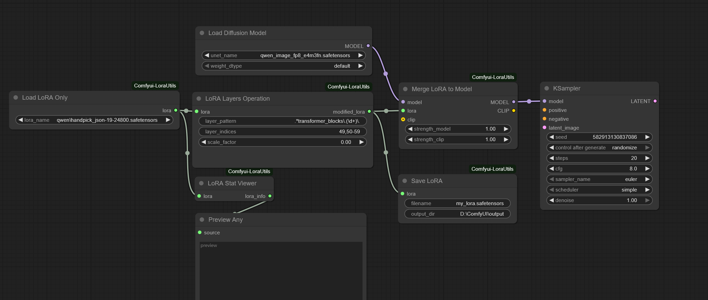

# ComfyUI LoRA Utils

A collection of utility nodes for advanced LoRA manipulation in ComfyUI, allowing users to load, modify, and apply LoRAs with fine-grained control.

## Example

  

You can find a complete ComfyUI workflow example in the example files. These workflows demonstrate how to use the various nodes for advanced LoRA manipulation, including loading, modifying, and applying LoRAs with precise layer control.

## Node

### Load LoRA Only

This node loads a LoRA file without applying it to any models. It provides separation between loading and application, allowing for more flexible LoRA workflows where you can modify the LoRA before applying it.

#### Inputs

- **lora_name**: The name of the LoRA file to load from the loras directory

#### Outputs

- **LORA**: The loaded LoRA state dictionary that can be used by other nodes

#### Behavior

- Loads a LoRA file and stores it in memory for efficient reuse
- Caches the loaded LoRA to avoid reloading when the same file is used
- Returns the LoRA in a format that can be modified or applied to models
- Allows separation of the loading and application phases for more flexible workflows

### LoRA Layers Operation

This node modifies specific layers in a loaded LoRA using pattern matching and index-based selection. It can zero out or scale specific layers based on regex patterns, providing fine-grained control over LoRA behavior.

#### Inputs

- **lora**: The LoRA state dictionary to modify
- **layer_pattern**: Regex pattern to match layer names (default: `.*transformer_blocks\.(\d+)\.`)
- **layer_indices**: Comma-separated list of layer indices to operate on, with support for ranges (e.g., '59', '10,11,12', or '50-53')
- **scale_factor**: Scale factor to apply. Use 0 to zero out layers, or any other value to multiply the layer weights

#### Outputs

- **modified_lora**: The modified LoRA state dictionary with specified layers adjusted

#### Behavior

- Uses regex pattern matching to identify which layers to modify
- Supports both individual indices and ranges (e.g., "50-53" includes 50, 51, 52, 53)
- When scale_factor is 0, zeros out the selected layers completely
- When scale_factor is non-zero, multiplies the selected layer weights by the scale factor
- Preserves all other layers unchanged
- Provides detailed logging about which layers were modified

### Merge LoRA to Model

This node applies a pre-loaded LoRA to diffusion and CLIP models. It allows separation of loading and application, and optionally supports applying to the model only without requiring a CLIP model.

#### Inputs

- **model**: The diffusion model to apply the LoRA to
- **lora**: The loaded LoRA to apply
- **strength_model**: How strongly to modify the diffusion model (default: 1.0, can be negative)
- **clip** (optional): The CLIP model to apply the LoRA to
- **strength_clip** (optional): How strongly to modify the CLIP model (default: 1.0, can be negative)

#### Outputs

- **MODEL**: The modified diffusion model
- **CLIP**: The modified CLIP model (or original model if no CLIP was provided)

#### Behavior

- Applies the loaded LoRA to the specified models with the given strengths
- Supports optional CLIP model - if not provided, only modifies the diffusion model
- When no CLIP is provided, returns the original model in place of the CLIP output
- Allows negative strength values for inverse LoRA effects
- Enables flexible workflows where LoRA loading, modification, and application are separate steps

### LoRA Stat Viewer

This node provides detailed information about a LoRA file's structure to help users define appropriate layer patterns for the LoRA Layers Operation node.

#### Inputs

- **lora**: The loaded LoRA to analyze

#### Outputs

- **lora_info**: A string containing detailed information about the LoRA structure

#### Behavior

- Provides total count of keys in the LoRA file
- Groups keys by layer types to show what kinds of LoRA components are present
- Shows first 10 keys as examples for pattern creation
- Identifies transformer block indices when present
- Displays the complete list of all keys in the LoRA for reference
- Helps users craft precise regex patterns for LoraLayersOperation

### Save LoRA

This node saves a modified LoRA state dictionary to a safetensors file. It allows users to persist their LoRA modifications for later use.

#### Inputs

- **lora**: The modified LoRA state dictionary to save
- **filename**: The filename to save the LoRA as (e.g. my_lora.safetensors)
- **output_dir** (optional): Directory to save the LoRA to. Defaults to ComfyUI output directory if not provided.

#### Outputs

- None (this is an output node that performs file saving)

#### Behavior

- Saves the LoRA to the specified filename in safetensors format
- Will overwrite existing files if they have the same name
- Automatically adds .safetensors extension if not present
- Saves to the ComfyUI output directory by default
- Optionally accepts a custom output directory
- Provides feedback message confirming the save location

## Key Features

- **Separation of Concerns**: Load, modify, and apply LoRAs in separate steps for maximum flexibility
- **Fine-grained Control**: Target specific layers using regex patterns and index ranges
- **Zero Out or Scale**: Control layer behavior by zeroing out or scaling individual layers
- **LoRA Analysis**: View LoRA structure to help define appropriate patterns
- **Optional CLIP Processing**: Flexibility to modify only the model without touching CLIP
- **Batch Layer Selection**: Support for ranges and multiple indices for efficient layer targeting

## Installation

1. Clone or download this repository into your ComfyUI's `custom_nodes` directory.
2. Restart ComfyUI.
3. The nodes will be available in the "LoraUtils" category.

## Contact
- **Twitter**: [@Lrzjason](https://twitter.com/Lrzjason)  
- **Email**: lrzjason@gmail.com  
- **QQ Group**: 866612947  
- **Wechatid**: fkdeai
- **Civitai**: [xiaozhijason](https://civitai.com/user/xiaozhijason)

## Sponsors me for more open source projects:

  <table>
    <tr>
      <td align="center">
        
Buy me a coffee:

        
      </td>
      <td align="center">
        
WeChat:

        
      </td>
    </tr>
  </table>

